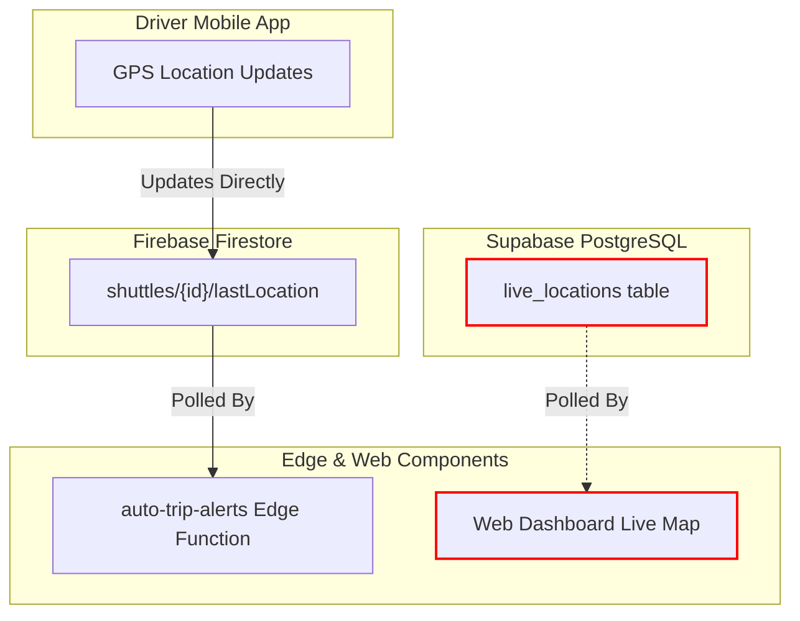
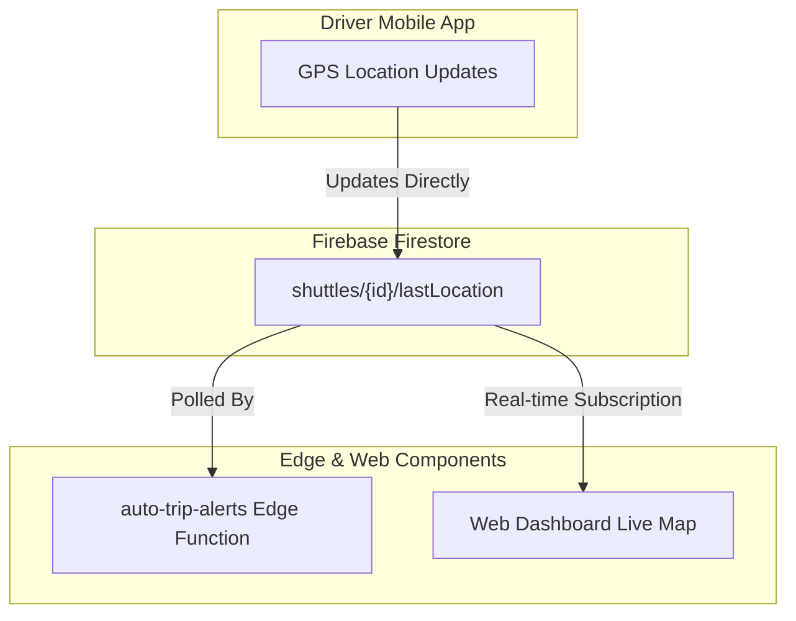

# Shuttle Location Architecture Report

This report analyzes the current location-tracking architecture of the Shuttle Guidance System, identifies structural inconsistencies, evaluates alternative synchronization designs, and details the recommended implementation plan.

---

## 1. Current Issue

There are currently **two independent database sources** storing shuttle location updates, creating an architectural split between live map visualizations and automated alerts:

1. **Driver Mobile App**: Writes location telemetry directly to **Cloud Firestore** under the `shuttles` collection:
   `shuttles/{shuttleId}/lastLocation: { lat, lng, updatedAt }`
2. **Web Admin Dashboard (Live Map)**: Polls the **Supabase** `live_locations` table every 3 seconds:
   `live_locations: { user_id, lat, lng, updated_at }`
3. **`auto-trip-alerts` Edge Function**: Periodically checks for trip status, arrivals, and delays by querying the **Cloud Firestore** `shuttles` collection (`shuttles.lastLocation`).

---

## 2. Root Cause & Architectural Breakdown

The system includes a Next.js serverless route `/api/update-location` which triggers the Supabase `update-location` Edge Function. However, this endpoint is **not invoked** by the mobile client. 

### Current Data Flow Diagram


**Consequences of the split:**
* **Dashboard Live Map Stale**: Since the driver client app never updates the Supabase `live_locations` table, the Live Map in the dashboard remains empty or outdated.
* **Alert Trigger Inconsistency**: While `auto-trip-alerts` correctly processes actual driver updates written to Firestore, administrators cannot visually see these vehicles moving on the map.

---

## 3. Comparison of Alternatives

To unify the architecture, one database must become the absolute source of truth.

### Option A: Supabase `live_locations` as Source of Truth

Under this option, all components transition to using Supabase for telemetry tracking.

* **Mobile App Refactoring**: The Flutter driver application must stop writing to Firestore and instead invoke `/api/update-location` or the Supabase Edge Function directly.
* **Alerts Refactoring**: The `auto-trip-alerts` Deno function must be modified to query Supabase PostgreSQL instead of Firestore.
* **Live Map**: Stays as-is (polling Supabase).

| Pros | Cons |
| :--- | :--- |
| **Relational Database Efficiency**: High-frequency writes in PostgreSQL are inexpensive and performant compared to document writes. | **High Refactoring Cost**: Requires modifying and redeploying the Flutter mobile app. |
| **PostGIS Spatial Indexing**: Permits advanced geofencing (e.g., checking if a shuttle is in a station) using server-side SQL queries. | **Cross-Database Dependencies**: Requires bridging Supabase tables and Firestore documents. |

---

### Option B: Firestore `shuttles.lastLocation` as Source of Truth (Recommended)

Under this option, Firestore remains the source of truth, and the web dashboard aligns with it.

* **Mobile App Refactoring**: None. (Already writes to Firestore).
* **Alerts Refactoring**: None. (Already reads from Firestore).
* **Live Map**: Refactor `useLiveShuttles.ts` hook in the web dashboard to listen to Firestore `shuttles` updates.

| Pros | Cons |
| :--- | :--- |
| **Zero Mobile Code Changes**: The mobile app doesn't require any updates, reducing deployment risk. | **Firestore Write Operations**: High-frequency telemetry writes can consume Firestore write quotas. |
| **Real-time Map Hydration**: Using Firestore `onSnapshot` listeners updates the map instantly via web-sockets instead of 3-second polling. | **No Native Geospatial Indexing**: Proximity checks must continue using math formulas in JavaScript/Deno memory. |

---

## 4. Recommended Architecture (Option B)

For this graduation project, **Option B** is recommended. It minimizes cross-platform deployment risks, consolidates data models into Firestore, and replaces the dashboard's heavy 3-second database polling loop with a modern, reactive Firestore WebSocket subscription.

### Unified Data Flow Diagram (Option B)


---

## 5. Implementation Plan

### Step 1: Refactor `useLiveShuttles.ts` in Dashboard

#### [MODIFY] [useLiveShuttles.ts](file:///home/malak/Documents/Graduation/Shuttle-Guidance-System-main-main/hooks/useLiveShuttles.ts)
Change the hook to establish a real-time Firestore listener on the `shuttles` collection where `isActive === true`. Map `lastLocation` fields into the existing `LiveShuttle` interface.

**New Implementation Draft:**
```typescript
import { useEffect, useState } from 'react'
import { collection, onSnapshot, query, where } from 'firebase/firestore'
import { db } from '@/lib/firebase'

export interface LiveShuttle {
  user_id:    string
  lat:        number
  lng:        number
  updated_at: string
}

export function useLiveShuttles() {
  const [shuttles, setShuttles] = useState<LiveShuttle[]>([])
  const [loading, setLoading] = useState(true)
  const [error, setError] = useState<string | null>(null)

  useEffect(() => {
    const q = query(collection(db, 'shuttles'), where('isActive', '==', true))
    
    const unsubscribe = onSnapshot(q, (snapshot) => {
      const activeList = snapshot.docs
        .map((doc) => {
          const data = doc.data()
          if (data.lastLocation) {
            return {
              user_id: data.driverId || doc.id,
              lat: data.lastLocation.lat,
              lng: data.lastLocation.lng,
              updated_at: data.lastLocation.updatedAt?.toDate?.()?.toISOString() || new Date().toISOString()
            }
          }
          return null
        })
        .filter((s) => s !== null) as LiveShuttle[]

      setShuttles(activeList)
      setLoading(false)
    }, (err) => {
      console.error('[useLiveShuttles] Firestore listener error:', err)
      setError(err.message)
      setLoading(false)
    })

    return () => unsubscribe()
  }, [])

  return { shuttles, loading, error }
}
```

### Step 2: Clean Up Unused Supabase Components (Optional)
Once Option B is validated:
- The `/api/update-location` route can be deprecated or kept as a legacy proxy.
- The Supabase Edge Function `update-location` is no longer needed.
